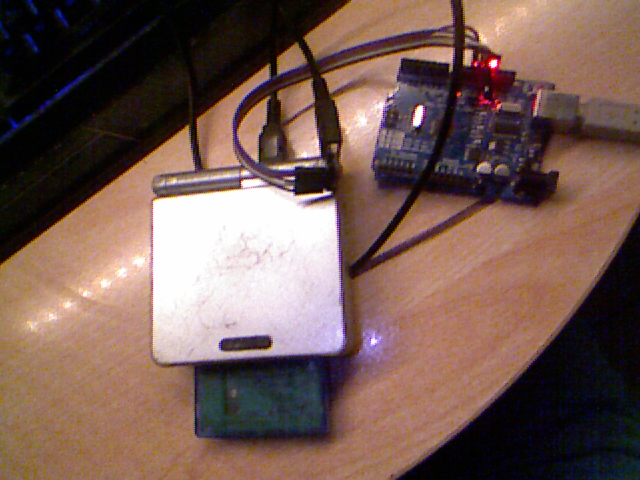

# Arduino Adapter GB
A work-in-process emulator of the Mobile Adapter GB peripheral with an Arduino.

**NOTE: THIS CODE IS NO LONGER UPDATED SINCE IT WAS MOVED TO REONTeam REPOSITORY, YOU CAN FIND THE UPDATED VERSION OF THE CODE HERE: [https://github.com/REONTeam/ArduinoAdapterGB](https://github.com/REONTeam/ArduinoAdapterGB)

## Requirements
- A Gameboy Color or GameBoy Advance
- Mobile Trainer cartridge and optionally, any Mobile Adapter GB compatible game
- An Arduino
- A Computer with Arduino IDE installed
- A pinout to connect the Arduino to the GameBoy Serial port (I use the [following pinout](https://github.com/Palmr/gb-link-cable), which does require a GameBoy Link Cable)

## Screenshots

## Connections

For Arduino UNO:

Connect SO to pin 12
Connect SI to pin 11
Connect SC to pin 13
Connect GND to a common ground

## What does work

- Serial data send/receive with the GameBoy

## What does not work

- While the arduino does correctly gets a 0x10 request, it doesn't receive any byte from the master (which are
a number of bytes used to tell the Trainer to get some data). Since the Adapter is ALWAYS the master, the GameBoy
should actually send some bytes and expect to receive the data from the Arduino.

- Anything else (Handling of 0x10 command is the only thing implemented)

## Notes

- The project don't use the SD connection because it's only used in GBA games.
- The GB should not have enough power to power on an Arduino, so VDD connection is not used.
- You can't use a standard GameBoy because the Mobile Adapter GB operates at a speed of 512Khz, only supported in GameBoy Color or GameBoy Advance.

## References

- [Dan Docs](https://shonumi.github.io/dandocs.html#magb). Protocol documentation
- [Mobile System Python Emulator](https://github.com/Incineroar/MobileAdapterGB/blob/master/mobilesystem.py). An emulator of the Adapter GB compatible with the GBC emulator BGB
